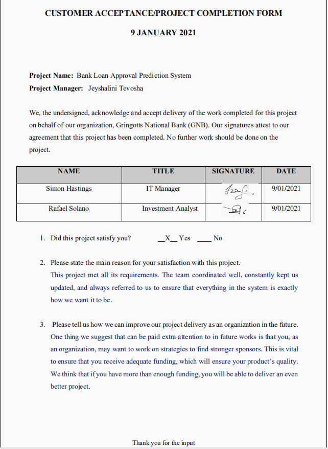
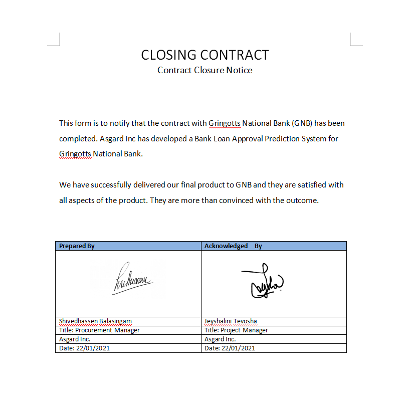

# PROJECT OVERVIEW 
## E. COMPLETING THE PROJECT 

### Closing Checklist 

#### Customer Acceptance Form 

  

#### Lessons-Learned Form

#### Final Project Report
**BANK LOAN APPROVAL PREDICTION SYSTEM**

**PROJECT OBJECTIVES**  

1. To develop a model that predicts the approval status of a loan
2. To save time consumption
3. To improve speed of customer service

**PROJECT SCHEDULE**

Our project was completed on time because of all our team members adhered to the Gantt Chart. There were some glitches throughout the process, but we were able to solve it. 

**PROJECT BUDGET**

Our team followed our very carefully planned budget. We did not need extra fundings. Everything was done within the set budget. 

**SCOPE**
Gringotts National Bank (GNB) associates with loans and finances. They deal with various types of loans such as car loans, business loans, home loans and so on. Going through the loan eligibility process can be tedious and very time consuming. Hence, an automated process will ease this process.
This is a classification problem where the goal is to predict whether a loan will or will not be approved. A model is developed by which the model is capable of using the features to predict the target varibale, which is if a loan is approved or a loan is declined.

#### Close Contract

   
##### Next: [Project Presentation](F-PROJECT_PRESENTATION.md)
