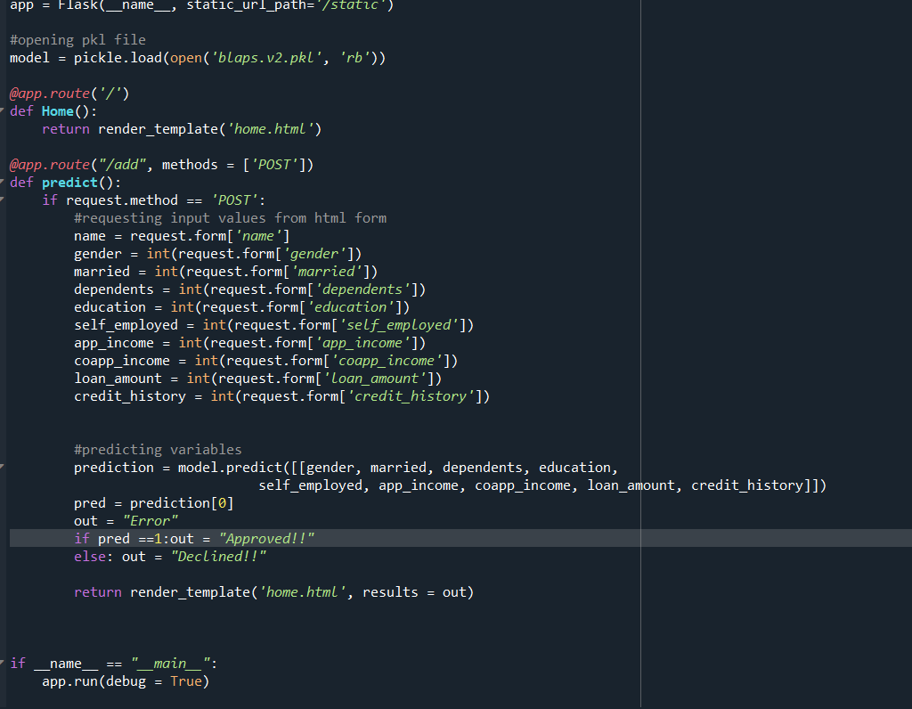

# PROJECT OVERVIEW
## D. EXECUTING THE PROJECT

### Project Design and Coding

#### System Flowchart:

#### System Design

#### Preprocessing 
The dataset went through some cleaning to remove any duplicates, replace missing values and to get rid of any unwanted columns. 

#### Model Building 
Next, we built our model. We used Logistic Regression for this project. In order to use Logistic Regression, all data must be numerical. We had already converted all non-numeric values to numeric values. After fitting the model, we saved the model into a pickle file using the Pickle model in Python. For our project, we the programming languages we used are Python, HTML and CSS. Python was used for the backend development while HTML and CSS were used for the frontend development. 

  Our model has an Accuracy of 78.9% and a Recall and Sensitivity of 94.0%.

#### Frontend of the System 
We used HTML for our system's frontend. We used this to collect inputs which will be useed to predict the output of whether a loan will be approved or declined. We used CSS to design the system. No frameworks were used. 

The HTML form:

The CSS: 

To deploy the model, we used Python's Flask module. Flask is a micro web framework written in Python. It is classified as a microframework because it does not require particular tools or libraries. It has no database abstraction layer, form validation, or any other components where pre-existing third-party libraries provide common functions.

### Project Result
Once all the input fields are entered, the system then predicts the loan status, of whether it is approved or declined. 
For example, the following inputs are used:

Name: Rafael 
Age: 32
Gender: Male
Marital Status: Single
Number of Dependents: 0
Education: Graduate 
Employment: Other 
Applicant Income: 6000
Coapplicant Income: 5000
Loan Amount (in thousands): 200
Credit History (0:Bad ; 1: Good) : 1

Based on these inputs, the system predicts the loan to be **Approved**. 

   
##### Next: [Project Completion](E-PROJECT_COMPLETION.md)

